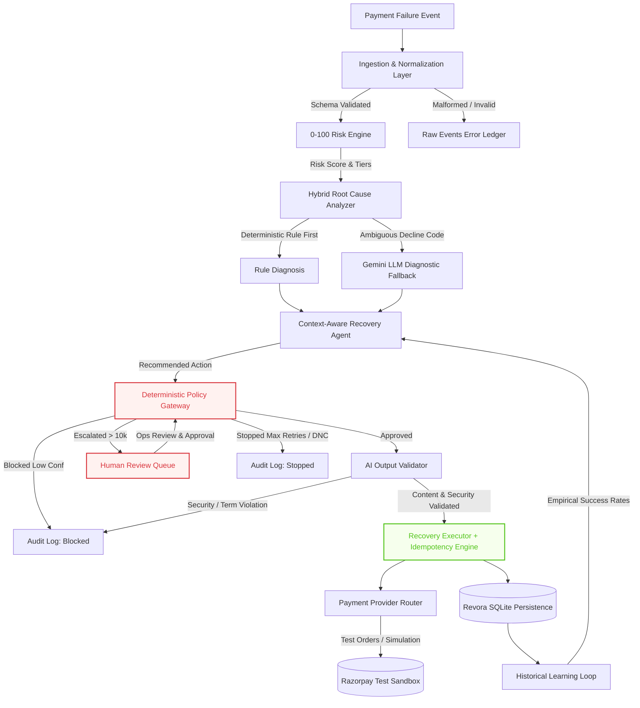

# REVORA — Autonomous Revenue Recovery Platform
## Architecture & Technical Specification · Razorpay Buildathon 2026 — Track 03

---

## 1. Executive Summary

**REVORA** is an enterprise-grade Autonomous AI Revenue Recovery platform built for **Track 03: AI Revenue Recovery** of the Razorpay Buildathon 2026. 

When digital transactions fail due to network timeouts, bank downtime, insufficient customer balance, expired cards, or revoked mandates, merchants lose significant revenue to unnecessary churn and abandoned checkouts. Revora solves this by providing an end-to-end, context-aware recovery loop that detects revenue at risk, diagnoses root causes, recommends bounded interventions, and executes compliant recoveries while adhering to strict deterministic safety guardrails.

### The Non-Negotiable Core Principle
> **"AI Can Recommend. Only the Deterministic Policy Gateway Can Authorize Financial Action."**

No machine learning model, LLM, prompt, or conversational interface possesses the authority to independently initiate or execute a financial action. Every recommendation is bounded by hard mathematical constraints, compliance rules, and enterprise safety invariants.

---

## 2. End-to-End System Architecture

```
                                  PAYMENT EVENT STREAM
                 [Webhooks / CSV Ingest / Merchant API / Voice Call]
                                           │
                                           ▼
                 ┌──────────────────────────────────────────────────┐
                 │        INGESTION & NORMALIZATION LAYER           │
                 │   • Pydantic Schema Validation (RawEvent)        │
                 │   • Deduplication & Field Normalization          │
                 │   • Malformed Record Isolation (raw_events)      │
                 └─────────────────────────┬────────────────────────┘
                                           │ Valid Event
                                           ▼
                 ┌──────────────────────────────────────────────────┐
                 │               0-100 RISK ENGINE                  │
                 │   • Explicit 0-100 Risk Score & Risk Tiers       │
                 │   • Financial Exposure, Velocity, Fatigue        │
                 │   • Hard-Stop Flags (DNC, Mandate Revoked)       │
                 └─────────────────────────┬────────────────────────┘
                                           │ Contextual Signals
                                           ▼
                 ┌──────────────────────────────────────────────────┐
                 │           HYBRID ROOT CAUSE ANALYZER             │
                 │   • Rule-First Deterministic Classification      │
                 │   • Gemini LLM Fallback for Ambiguous Codes      │
                 │   • Recoverability & Channel Attribution         │
                 └─────────────────────────┬────────────────────────┘
                                           │ Diagnosis & Evidence
                                           ▼
                 ┌──────────────────────────────────────────────────┐
                 │             CONTEXT-AWARE RECOVERY AGENT         │
                 │   • Intervention Selection (Retry/Outreach/Stop) │
                 │   • Historical Empirical Learning Loop           │
                 │   • Recovery Probability & Confidence Scoring    │
                 └─────────────────────────┬────────────────────────┘
                                           │ Action Recommendation
                                           ▼
                 ┌──────────────────────────────────────────────────┐
                 │       DETERMINISTIC POLICY GATEWAY (AUTHORITY)   │
                 │   1. Only Failed Payments (FAILED_PAYMENT_ONLY)  │
                 │   2. Hard Stops (DNC, Mandate, Stolen/Expired)   │
                 │   3. Max Retry Ceiling (<= 2 Attempts)           │
                 │   4. Amount Threshold (<= ₹10,000 Auto-Action)   │
                 │   5. Max Recovery Window (<= 24 Hours / 1440m)   │
                 │   6. Confidence Floor (Confidence >= 60%)        │
                 │   7. Intervention Budget (<= 1 Customer Outreach)│
                 └──────┬──────────────┬──────────────┬─────────────┘
                        │              │              │
             APPROVED   │   ESCALATED  │      BLOCKED │   STOPPED
             ┌──────────┘   ┌──────────┘      ┌───────┴──────┐
             │              │                 │              │
             ▼              ▼                 ▼              ▼
     ┌──────────────┐ ┌──────────────┐ ┌──────────────┐ ┌──────────────┐
     │  AI OUTPUT   │ │ HUMAN REVIEW │ │ AUDIT RECORD │ │ RECOVERY     │
     │  VALIDATOR   │ │    QUEUE     │ │ (Risk/Policy │ │ PERMANENTLY  │
     │ (Bounds,     │ │ (Ops Desk /  │ │  Violation)  │ │ HALTED       │
     │  Forbidden   │ │  Manual Auth)│ └──────────────┘ └──────────────┘
     │  Terms,      │ └──────┬───────┘
     │  Security)   │        │ Approved
     └──────┬───────┘        │
            │                ▼
            │        [Policy Gateway]
            │          (Re-verifies)
            ▼                │
     ┌──────────────┐        │
     │   RECOVERY   │◄───────┘
     │   EXECUTOR   │
     │ (Idempotency │
     │  Key Engine) │
     └──────┬───────┘
            │
            ▼
     ┌────────────────────────────────────────────────┐
     │             PAYMENT PROVIDER ROUTER            │
     │  • Razorpay Test Sandbox (api.razorpay.com/v1) │
     │  • Deterministic Simulation Engine             │
     │  • Zero Real-Money Moving Automation           │
     └──────────────────────┬─────────────────────────┘
                            │
                            ▼
     ┌────────────────────────────────────────────────┐
     │       OUTCOME, AUDIT & HISTORICAL LEARNING     │
     │  • Immutable Audit Log (SHA / Action Trail)    │
     │  • Human Review Queue Resolution               │
     │  • Empirical Feedback Matrix for Next Cycle    │
     │  • Real-Time WebSocket / Polling Control Center│
     └────────────────────────────────────────────────┘
```

---

## 3. Mermaid Structural Architecture



---

## 4. Pipeline Stages & Detailed Implementation

### Stage 1: Ingestion & Normalization Layer (`services/ingestion_service.py`)
- **Pydantic Validation (`RawEvent`)**: Validates transaction ID, positive amounts (`amount > 0`), valid currency (`INR`), canonical payment methods (`CARD`, `UPI`, `NETBANKING`, `WALLET`), and error metadata.
- **Normalization**: Standardizes timestamps to ISO-8601 UTC and parses retry attempts and failure codes.
- **Fault-Tolerant Error Ledger**: Malformed rows are logged to `raw_events` table with exact validation errors (`ingestion_status='REJECTED'`) without crashing batch execution.

### Stage 2: Explicit 0–100 Risk Engine (`services/risk_detector.py`)
- Separates *"How risky is this transaction?"* from *"Why did it fail?"*.
- Generates continuous `risk_score` (0.0 to 100.0) mapped into 4 distinct risk tiers:
  - **LOW (0–25)**: Low amount, zero retries, high customer historical success rate (>85%).
  - **MEDIUM (26–50)**: Standard transaction, transient failure, recoverable window open.
  - **HIGH (51–75)**: High retry count, aged failure (>12 hours), lower customer score.
  - **CRITICAL (76–100)**: Amount > ₹10,000, revoked mandate, card reported stolen, or opted out.

### Stage 3: Hybrid Root Cause Analyzer (`services/root_cause_analyzer.py`)
- **Rule-First Priority**: Deterministically maps standard error codes:
  - `NETWORK_ERROR`, `TIMEOUT` ➔ `NETWORK_ERROR` (Transient, high recoverability).
  - `INSUFFICIENT_FUNDS`, `LOW_BALANCE` ➔ `INSUFFICIENT_FUNDS` (Customer-assisted recovery).
  - `EXPIRED`, `CARD_EXPIRED` ➔ `EXPIRED_CARD` (Payment instrument update required).
  - `MANDATE_REVOKED` ➔ `MANDATE_FAILURE` (Non-recoverable compliance stop).
  - `STOLEN`, `FRAUD` ➔ `PERMANENT_BANK_DECLINE` (Immediate halt).
- **Gemini LLM Fallback**: Only invoked when failure code is ambiguous (`UNKNOWN_ERROR`, `GENERIC_DECLINE`), strictly enforcing a 5-second timeout and falling back to deterministic classification if offline.

### Stage 4: Context-Aware Recovery Agent (`services/recovery_agent.py`)
- Selects from 4 bounded recovery actions:
  - `RETRY_NOW`: For immediate network or switch timeouts.
  - `RETRY_LATER`: For temporary bank system downtime or maintenance windows.
  - `CONTACT_CUSTOMER`: For soft failures (insufficient funds, auth drop-off).
  - `ESCALATE_TO_HUMAN`: For VIP accounts, high amounts, or recurring anomalies.
  - `STOP_RECOVERY`: For permanent declines or exhausted limits.
- **Historical Learning Loop**: Injects empirical outcome distributions (`historical_success_rate`) from previous batches into confidence calculation.

### Stage 5: Deterministic Policy Gateway (`services/guardrail_engine.py`)
The supreme authority in Revora. Evaluates 7 invariant rules:
1. `FAILED_PAYMENT_ONLY`: Prevents actions on already settled or success records.
2. `DO_NOT_CONTACT`: Blocks customer communication if customer has opted out.
3. `MANDATE_REVOKED`: Halts recovery if recurring authorization was withdrawn.
4. `INVALID_CARD_STATUS`: Halts recovery if instrument is stolen, expired, or blocked.
5. `MAX_RETRIES`: Hard ceiling of at most 2 retry attempts.
6. `MAX_AUTO_ACTION_AMOUNT`: Any amount > ₹10,000 is automatically escalated to human review.
7. `MAX_RECOVERY_WINDOW`: Stops recovery after 24 hours (1,440 minutes) from initial failure.
8. `MIN_RECOVERY_CONFIDENCE`: Blocks automatic execution if confidence < 60%.
9. `INTERVENTION_BUDGET`: Limits customer-facing outreach to at most 1 intervention.

### Stage 6: AI Output Validator (`services/ai_output_validator.py`)
- Validates all generated LLM responses against strict JSON schemas.
- Rejects forbidden words (`bypass`, `override`, `guaranteed`, `loophole`).
- **Security Check**: Immediately flags and drops any customer message or voice utterance attempting to collect `CVV`, `OTP`, `PIN`, or full card numbers.

### Stage 7: Recovery Executor & Idempotency Engine (`services/recovery_executor.py`)
- Executes approved interventions via configured provider.
- **Cryptographic Idempotency Key**: `{transaction_id}:{action}:{attempt_number}`. Guarantees that duplicate webhooks, re-transmitted batch events, or network retries never trigger double-recovery.

### Stage 8: Payment Provider Router (`services/razorpay_service.py`)
- Supports **Razorpay Test / Sandbox Mode** (`https://api.razorpay.com/v1`) using `rzp_test_*` credentials.
- Strictly isolated from live funds (`supports_real_money = False`).
- Creates sandbox test orders, performs test verification, and falls back to deterministic simulation provider when test API keys are unconfigured.

### Stage 9: Voice AI Recovery Interface ("Talk to Revora") (`services/voice_service.py`)
- Integrates browser Web Speech API (`webkitSpeechRecognition` / `SpeechRecognition`) with Text-to-Speech playback.
- Recognizes user intent: `EXPLAIN_FAILURE`, `RETRY_PAYMENT`, `REQUEST_HUMAN`, `SCHEDULE_LATER`.
- **Enforces Zero-Trust Voice Policy**:
  - Utterances with sensitive data (`CVV`, `OTP`) receive `SECURITY_VIOLATION` and are dropped.
  - Confirmation from the user still routes through the Deterministic Policy Gateway. If policy rejects or escalates, voice cannot override it.

### Stage 10: Human Review Queue (`services/human_queue_service.py`)
- Captures all `ESCALATED` transactions for operational governance.
- Manages lifecycle transitions: `OPEN` ➔ `IN_REVIEW` ➔ `RESOLVED`.
- Any resolution action approved by a human is re-validated through the Policy Gateway before execution.

---

## 5. Database Schema

All data is persistently maintained in `data/revora.db` with append-only integrity:

```sql
-- 1. Ingestion Error & Event Ledger
CREATE TABLE raw_events (
    event_id INTEGER PRIMARY KEY AUTOINCREMENT,
    transaction_id TEXT, customer_id TEXT, amount REAL, currency TEXT,
    payment_method TEXT, failure_reason TEXT, gateway_error_code TEXT,
    retry_count INTEGER, created_at TEXT, customer_success_rate REAL,
    customer_history TEXT, do_not_contact INTEGER, mandate_revoked INTEGER,
    card_status TEXT, ingestion_status TEXT, validation_errors TEXT,
    ingested_at TEXT
);

-- 2. Core Normalized Transactions
CREATE TABLE transactions (
    transaction_id TEXT PRIMARY KEY, customer_id TEXT, merchant_id TEXT,
    amount REAL, currency TEXT, timestamp TEXT, payment_method TEXT,
    payment_status TEXT, failure_reason TEXT, retry_count INTEGER,
    customer_success_rate REAL, customer_previous_transactions INTEGER,
    time_since_failure_minutes INTEGER, customer_segment TEXT,
    risk_score REAL, ground_truth_recoverable INTEGER,
    gateway_error_code TEXT, do_not_contact INTEGER DEFAULT 0,
    mandate_revoked INTEGER DEFAULT 0, card_status TEXT DEFAULT 'ACTIVE'
);

-- 3. Recovery Cases (Decision & Execution State)
CREATE TABLE recovery_cases (
    case_id INTEGER PRIMARY KEY AUTOINCREMENT, transaction_id TEXT,
    diagnosis TEXT, recovery_probability REAL, confidence REAL,
    recommendation TEXT, reason TEXT, guardrail_status TEXT,
    blocked_reason TEXT, guardrail_name TEXT, final_action TEXT,
    outcome TEXT, recovered_amount REAL DEFAULT 0,
    analyzed_at TEXT, executed_at TEXT, batch_id INTEGER DEFAULT NULL,
    policy_version TEXT DEFAULT 'agentic_optimized_v2',
    intervention_step TEXT DEFAULT NULL, historical_success_rate REAL DEFAULT NULL,
    evidence_context TEXT DEFAULT NULL, risk_score REAL DEFAULT 0,
    risk_tier TEXT DEFAULT 'LOW', root_cause TEXT DEFAULT NULL,
    root_cause_source TEXT DEFAULT 'RULE', llm_message TEXT DEFAULT NULL,
    llm_validation_status TEXT DEFAULT NULL, provider TEXT DEFAULT 'SIMULATION',
    provider_payment_id TEXT DEFAULT NULL, execution_mode TEXT DEFAULT 'SIMULATION',
    idempotency_key TEXT DEFAULT NULL
);

-- 4. Human Review Queue
CREATE TABLE human_queue (
    queue_id INTEGER PRIMARY KEY AUTOINCREMENT, case_id INTEGER,
    transaction_id TEXT, customer_id TEXT, amount REAL, risk_score REAL,
    root_cause TEXT, agent_recommendation TEXT, confidence REAL,
    guardrail_trigger TEXT, reason TEXT, created_at TEXT,
    status TEXT DEFAULT 'OPEN', reviewed_by TEXT DEFAULT NULL,
    review_notes TEXT DEFAULT NULL, resolved_at TEXT DEFAULT NULL
);

-- 5. Voice Interaction Sessions
CREATE TABLE voice_sessions (
    session_id TEXT PRIMARY KEY, transaction_id TEXT, customer_id TEXT,
    status TEXT, conversation_transcript TEXT, detected_intent TEXT,
    policy_decision TEXT, execution_result TEXT, started_at TEXT, ended_at TEXT
);

-- 6. Immutable Audit Trail
CREATE TABLE audit_logs (
    id INTEGER PRIMARY KEY AUTOINCREMENT, timestamp TEXT,
    transaction_id TEXT, event_type TEXT, actor TEXT,
    description TEXT, metadata TEXT, batch_id INTEGER DEFAULT NULL,
    case_id INTEGER DEFAULT NULL
);

-- 7. Batch Runs & Analytics
CREATE TABLE batch_runs (
    id INTEGER PRIMARY KEY AUTOINCREMENT, started_at TEXT, completed_at TEXT,
    status TEXT, events_processed INTEGER DEFAULT 0, actions_executed INTEGER DEFAULT 0,
    successful_recoveries INTEGER DEFAULT 0, revenue_recovered REAL DEFAULT 0,
    report TEXT, total_events INTEGER DEFAULT 0, progress INTEGER DEFAULT 0,
    current_activity TEXT, failed INTEGER DEFAULT 0, escalated INTEGER DEFAULT 0,
    blocked INTEGER DEFAULT 0, stopped INTEGER DEFAULT 0, revenue_at_risk REAL DEFAULT 0,
    policy_version TEXT DEFAULT 'baseline_v1'
);
```

---

## 6. Verification & Automated Test Suite

Revora is verified through an automated suite of **29 Unit Tests** in `backend/test_services.py`:

| # | Subsystem Tested | Test Method | Outcome |
|---|---|---|:---:|
| 1 | Agent Decision Engine | `test_contextual_agent_decisions` | **PASS** |
| 2 | High-Value Guardrail | `test_high_value_guardrail_escalation` | **PASS** |
| 3 | Max Retries Guardrail | `test_maximum_retry_stop` | **PASS** |
| 4 | Stale Recovery Window | `test_stale_recovery_window_stop` | **PASS** |
| 5 | Low Confidence Stop | `test_low_confidence_stop` | **PASS** |
| 6 | Executor Rejections | `test_executor_rejects_unapproved_actions` | **PASS** |
| 7 | Execution Success | `test_approved_execution_success` | **PASS** |
| 8 | Rule Checking Ledger | `test_rules_checked_populated` | **PASS** |
| 9 | Audit Trail Persistence | `test_audit_event_creation` | **PASS** |
| 10 | Ground-Truth Isolation | `test_ground_truth_isolation` | **PASS** |
| 11 | Explainability Engine | `test_why_revora_explanations` | **PASS** |
| 12 | Guardrail Matrix | `test_guardrail_breakdown_consistency` | **PASS** |
| 13 | Batch Persistence | `test_batch_service_persistence` | **PASS** |
| 14 | Historical Evidence | `test_agentic_evidence_incorporation` | **PASS** |
| 15 | Customer Outreach | `test_customer_assisted_recovery_workflow` | **PASS** |
| 16 | Intervention Budget | `test_intervention_budget_exhaustion` | **PASS** |
| 17 | Determinism Integrity | `test_deterministic_execution` | **PASS** |
| 18 | Funnel Reconciliation | `test_recovery_analytics_funnel_reconciliation` | **PASS** |
| 19 | Policy Delta Comp | `test_policy_comparison_structure` | **PASS** |
| 20 | Ingestion Validation | `test_ingestion_service_validation` | **PASS** |
| 21 | 0-100 Risk Engine | `test_risk_engine_tiers_and_scoring` | **PASS** |
| 22 | Root Cause Analyzer | `test_root_cause_rule_first_classification` | **PASS** |
| 23 | AI Output Validator | `test_ai_output_validator_rejection` | **PASS** |
| 24 | LLM Fallback Safety | `test_llm_service_fallback` | **PASS** |
| 25 | Gateway Hard Stops | `test_policy_gateway_hard_stops` | **PASS** |
| 26 | Human Queue Flow | `test_human_review_queue_lifecycle` | **PASS** |
| 27 | Razorpay Test Mode | `test_razorpay_provider_test_mode_isolation` | **PASS** |
| 28 | Idempotency Engine | `test_idempotency_duplicate_prevention` | **PASS** |
| 29 | Voice Agent Security | `test_voice_service_security_rejection_and_policy_routing` | **PASS** |

---

## 7. Judge Demo & Technical Pitch Script

1. **The Ingestion & Risk Inspection**:
   - Open Revora Control Center at `http://localhost:3000`.
   - Click `+ INGEST EVENTS`. Paste sample CSV payment failures. Show how valid events are normalized while malformed events are safely recorded with line-by-line validation errors.
2. **The 3 Invariant Cases in Razorpay Test Mode**:
   - Navigate to the **Razorpay Test Mode** tab.
   - Click **Case A (`TX10988`, ₹2,411)**: Transient network timeout. Trace how it passes through Ingestion ➔ Risk Engine (Score 20, MEDIUM) ➔ Root Cause (NETWORK_ERROR) ➔ Agent (RETRY_NOW) ➔ Policy Gateway (APPROVED) ➔ Razorpay Test Settlement.
   - Click **Case B (`TX11000`, ₹10,536)**: High-value payment. Show that even though the AI suggests retry, the **Deterministic Policy Gateway overrides and ESCALATES to Human Review**, recovering ₹0 automatically and enqueuing the case.
   - Click **Case C (`TX10995`, Max Retries)**: Already retried twice. Show that the Policy Gateway enforces `MAX_RETRIES` hard stop, preventing customer harassment.
3. **The Voice Recovery Demo ("Talk to Revora")**:
   - Navigate to the **Voice Recovery** tab.
   - Click the mic or prompt chip *"Why did my payment fail?"* — Revora explains the failure clearly using contextual insights.
   - Click prompt chip *"Please retry my payment"* — Revora evaluates the Policy Gateway and authorizes the retry.
   - Click prompt chip *"My CVV is 123, please retry"* — **Watch the security guardrail immediately trigger**: Revora blocks the credential disclosure, refuses to store or process CVVs/OTPs, and issues a compliance alert.
4. **Human Review Queue**:
   - Navigate to **Human Queue**. View `TX11000` waiting for senior authorization. Click `Review`, document notes, and `Resolve`.
5. **Batch Financial Attribution & Audit Trail**:
   - View the Overview funnel: ₹1.785 Cr revenue at risk, verified recovered amount, zero hallucinations, 100% auditable down to individual SQLite row hashes.
